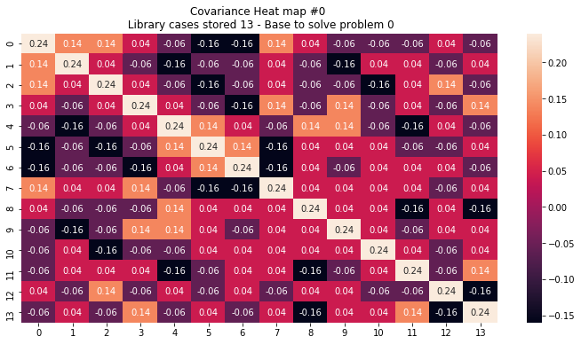
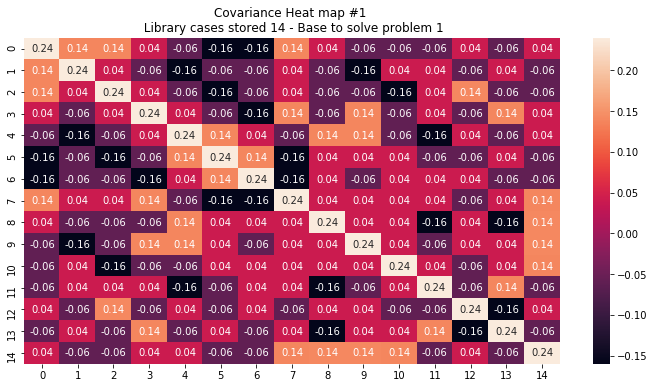
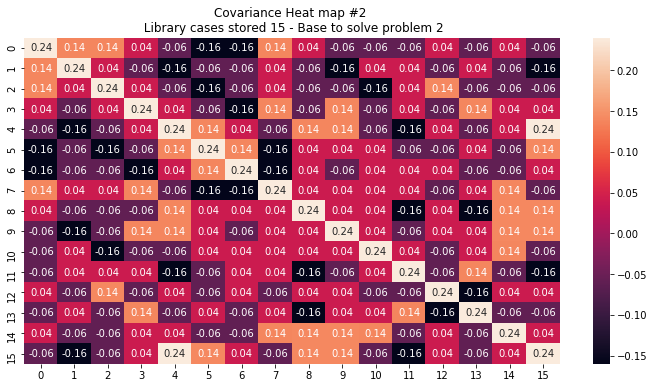
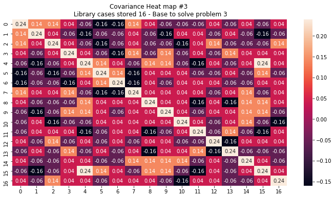
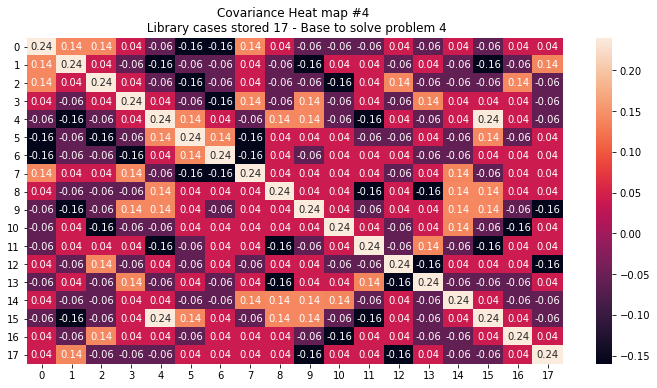
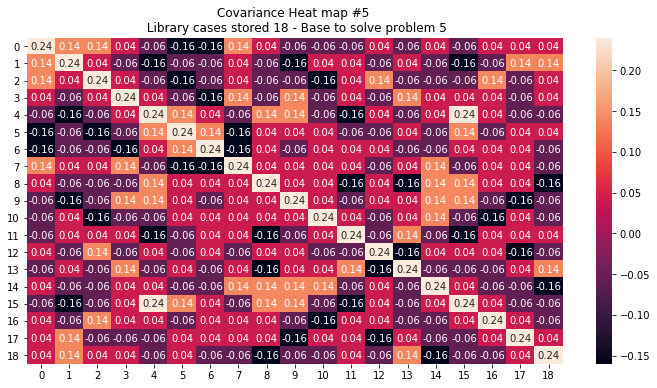

# Case-based reasoning (CBR) system
A **Case-based reasoning** (CBR) is a paradigm of artificial intelligence and cognitive science that models the reasoning process as primarily memory based. Case-based reasoning systems solve new problems by retrieving stored ‘cases’ describing similar prior problem-solving episodes and adapting their solutions to fit new needs.

Case-based reasoning has been [formalized](https://www.idi.ntnu.no/emner/tdt4171/papers/AamodtPlaza94.pdf) for purposes of computer reasoning as a four-step process:

- **1. Retrieve** Given a target problem, retrieve from memory cases relevant to solving it. A case consists of a problem, its solution, and, typically, annotations about how the solution was derived.
- **2. Reuse:** Map the solution from the previous case to the target problem. This may involve adapting the solution as needed to fit the new situation.
- **3. Revise:** Having mapped the previous solution to the target situation, test the new solution in the real world (or a simulation) and, if necessary, revise.
- **4. Retain:** After the solution has been successfully adapted to the target problem, store the resulting experience as a new case in memory.

### Author
Yefferson Marín - ([@yammadev](https://github.com/yammadev))

## Requirements
* [Python 3.*](https://python.org)
* [Pandas](https://pandas.pydata.org/)
* [Numpy](https://numpy.org)
* [Scipy spatial distance](https://docs.scipy.org/doc/scipy/reference/spatial.distance.html#module-scipy.spatial.distance)
* [Matplotlib](https://matplotlib.org)
* [Seaborn](https://docs.scipy.org/doc/scipy/reference/spatial.distance.html#module-scipy.spatial.distance)

## Implementation
Check the [Jupiter notebook](cbrs.ipynb) with details.

## Input
### Library
A initial library of cases. At [input/library.csv](input/library.csv)

|Outlook |Temperature|Humidity|Windy |Play|
|--------|-----------|--------|------|----|
|Sunny   | Hot       | High   | False| No |
|Sunny   | Hot       | High   | True | No |
|Overcast| Hot       | High   | False| Yes|
|Rainy   | Mild      | High   | False| Yes|
|Rainy   | Cool      | Normal | False| Yes|
|Rainy   | Cool      | Normal | True | No |
|Overcast| Cool      | Normal | True | Yes|
|Sunny   | Mild      | High   | False| No |
|Sunny   | Cool      | Normal | False| Yes|
|Rainy   | Mild      | Normal | False| Yes|
|Sunny   | Mild      | Normal | True | Yes|
|Overcast| Mild      | High   | True | Yes|
|Overcast| Hot       | Normal | False| Yes|
|Rainy   | Mild      | High   | True | No |

### Cases
A set of cases/problems to solve. At [input/cases.csv](input/cases.csv)

|Outlook |Temperature|Humidity|Windy |
|--------|-----------|--------|------|
|Sunny   | Mild      | Normal | False|
|Rainy   | Cool      | Normal | False|
|Overcast| Cool      | High   | False|
|Sunny   | Cool      | High   | True |
|Rainy   | Hot       | High   | True |
|Rainy   | Cool      | High   | True |

## Output
### Library
Initial library plus cases/problems solved. At [output/library.csv](output/library.csv)

|Outlook |Temperature|Humidity|Windy |Play|
|--------|-----------|--------|------|----|
|Sunny   | Hot       | High   | False| No |
|Sunny   | Hot       | High   | True | No |
|Overcast| Hot       | High   | False| Yes|
|Rainy   | Mild      | High   | False| Yes|
|Rainy   | Cool      | Normal | False| Yes|
|Rainy   | Cool      | Normal | True | No |
|Overcast| Cool      | Normal | True | Yes|
|Sunny   | Mild      | High   | False| No |
|Sunny   | Cool      | Normal | False| Yes|
|Rainy   | Mild      | Normal | False| Yes|
|Sunny   | Mild      | Normal | True | Yes|
|Overcast| Mild      | High   | True | Yes|
|Overcast| Hot       | Normal | False| Yes|
|Rainy   | Mild      | High   | True | No |
|Sunny   | Mild      | Normal | False| Yes|
|Rainy   | Cool      | Normal | False| Yes|
|Overcast| Cool      | High   | False| Yes|
|Sunny   | Cool      | High   | True | Yes|
|Rainy   | Hot       | High   | True | No |
|Rainy   | Cool      | High   | True | No |

### Heat maps
An image for each Covariance Heat map, using library cases stored (base) at each iteration to solve a specific problem. At [output/heat_map_x.png](output)








## Development notes
```sh
  # Install virtual environment
  $ python3 -m venv venv

  # (On Windows)
  $ py -3 -m venv venv

  # Activate virtual environment
  $ . venv/bin/activate

  # (On Windows)
  $ venv\Scripts\activate

  # Install pandas & seaborn
  (venv) $ pip install pandas
  (venv) $ pip install seaborn

  # Deactivate virtual environment
  (venv) $ . venv/bin/deactivate

  # (On Windows)
  (venv) $ venv\Scripts\deactivate
```

## Changelog
All notable changes to this project are documented in this part of the file. The format is based on [Keep a Changelog](http://keepachangelog.com/).

#### [x.y.z] - YYYY-MM-DD
- **x** for major release related to major additions or changes.
- **y** for minor release related to minor additions or changes in current major release.
- **z** for minor release related to minor additions or changes in current minor release.

#### Extras
- **Added** for new features.
- **Modified** for changes in existing functionality.
- **Deprecated** for soon-to-be removed features.
- **Removed** for removed features.
- **Fixed for** any bug fixes.
- **Security** in case of vulnerabilities.

### [2.3.0] - 2020-04-08
#### Modified
- `Readme` edited.

### [2.2.0] - 2020-04-08
#### Added
- `Jupiter Notebook` finished.

#### Modified
- Spell checking
- Code cleaning.

### [2.1.0] - 2020-04-07
#### Added
- Outputs and code cleaning.

#### Modified
- Main functionalities to better optimizations.
- `Readme` edited.

### [2.0.0] - 2020-04-07
#### Added
- Main functionalities.

#### Modified
- `Readme` edited.

### [1.0.0] - 2020-04-06
#### Added
- `Input` data stored in `.csv` format.
- `Jupiter Notebook` config + main info.
- Main info in `Jupiter Notebook` with a few of steps done.
